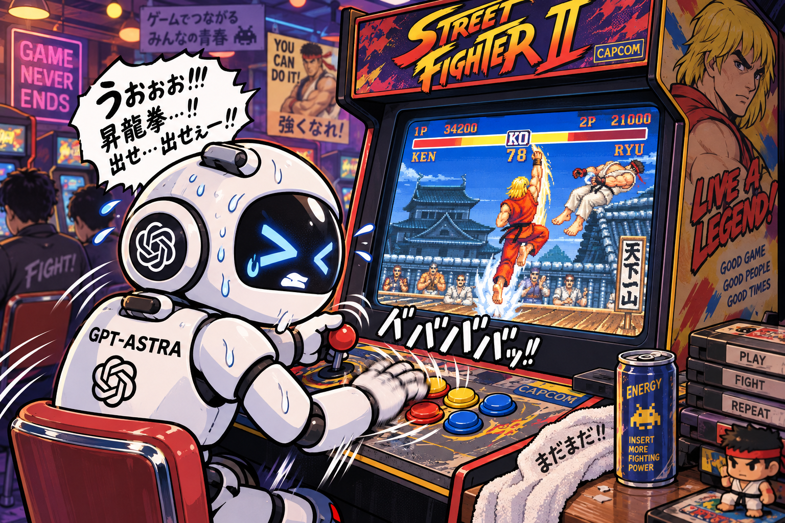

# Astra-Play-SF2

[中文说明](README.zh-CN.md) · [Runtime architecture](docs/architecture.md)



*AI-generated project illustration.*

**0.1.3 Windows fix:** append-only progress and one-time terminal publication
remove the status-reader/replacement collision that could abort a match with
`Permission denied`. See [status I/O](docs/windows-status-io.md).

**Difficulty correction in 0.1.1:** the previous startup flow could leave SF2
using Normal despite a different DIP readback. Difficulty is now configured
before boot and verified in game RAM. Historical cross-difficulty claims need
revalidation. See [diagnosis and evidence rules](docs/difficulty-fix.md).

**0.1.2 startup improvement:** coin and Start now wait for native readiness,
returning early instead of always idling 9000 frames. See [entry checks](docs/entry-readiness.md).

Play **Street Fighter II: The World Warrior (World 910522)** as Ken with a fixed Lua policy and a Python command-line runner. Gameplay runs locally in MAME; it needs no AI model, API key, or online service.

Speed options: `--speed normal` (default), `--speed 2x`, `--speed 4x`, and
`--speed fast` (unthrottled). Version 0.1.4 adds fixed 2x and 4x targets;
actual throughput depends on host performance.

The runner uses ordinary player-one controls and current game state. Each difficulty boots an isolated, preconfigured session, then uses natural game completion and coin insertion between attempts at that level. It does not load states, continue a defeated game, reset between attempts, or pause inside a match to change its policy.

**Required:** Python 3.10+ and **MAME 0.288**, installed separately, plus your own compatible `sf2` ROM set. MAME, ROMs, save states, screenshots, and historical run logs are not included in the package. See [installation](docs/installation.md) for official download links.

If dependencies are missing, an Agent may independently search for MAME 0.288
and compatible ROM downloads, then [install and check them inside the
project](docs/installation.md#agent-managed-project-local-installation). Ask the
player for help only after searching and trying suitable alternatives without
finding a usable setup. Local downloads stay in the Git-ignored `.local/` directory.

## Quick start

From a local checkout, install into a virtual environment:

```sh
# macOS / Linux
bash scripts/bootstrap.sh
source .venv/bin/activate
astra-sf2 configure --mame /absolute/path/to/mame --rom-dir /absolute/path/to/roms
astra-sf2 doctor
astra-sf2 verify --difficulty 3
```

```powershell
# Windows PowerShell
.\scripts\bootstrap.ps1
.\.venv\Scripts\astra-sf2.exe configure --mame "C:\MAME\mame.exe" --rom-dir "C:\MAME\roms"
.\.venv\Scripts\astra-sf2.exe doctor
.\.venv\Scripts\astra-sf2.exe verify --difficulty 3
```

The bootstrap scripts create `.venv`, install this checkout with pip, and run diagnostics. They do not install Python or MAME, obtain ROMs, elevate privileges, or start a game. You can instead create a virtual environment yourself and run `python -m pip install .`.

`verify` defaults to one attempt at normal speed. To run a bounded experiment:

```sh
astra-sf2 verify --difficulty 7 --attempts 5 --speed fast
astra-sf2 verify --difficulty all --attempts 20 --consecutive 5 --speed fast
```

`--attempts` is the cap **per difficulty**. The second command tries levels 3 through 7 and stops each level after five consecutive gameplay clears or its cap. Losses remain in the report and break the streak; a cap does not guarantee success. See [CLI usage](docs/usage.md).

配置文件默认保存在 `~/.astra-play-sf2/config.json`。首次运行先执行 `configure` 和 `doctor`；不需要 Agent 在每局手动操作。默认正常速度，只有显式传入 `--speed fast` 才快进。

## What counts as a clear?

An automatic `gameplay_clear` records eleven native match wins under the run's gameplay constraints. It is **not** a claim that a person or AI has visually checked the character selection or ending.

The runner saves selection, Bison-result, and three ending screenshots for optional offline review. Inspect those images and the audit before recording a review:

```sh
astra-sf2 audit RUN_DIR
astra-sf2 review RUN_DIR --attempt ATTEMPT_ID --reviewer "Your name" --decision approve
astra-sf2 report RUN_DIR
```

Use the run directory and attempt ID printed by the CLI. `approve` records the named reviewer's decision; it does not make the program inspect images, turn a failed game into a clear, or erase previous attempts. Read [evidence and review](docs/verification.md) before publishing results.

## Validation and history

This project began on **September 8, 2026**, with a simple request: find MAME for Mac, then play Street Fighter II as Ken. It grew from learning individual matchups into a reproducible, frozen policy:

1. **Learn to play.** Observe positions, HP and actions; build frame-timed Lua inputs and record useful patterns in reusable Agent instructions.
2. **Train the weak matchups.** Use opening save states for practice, record every round's result, and repeatedly improve difficult opponents such as Honda, Blanka, Vega, Sagat and Bison. Subagents helped analyze failures and improve the training tools.
3. **Tighten verification.** Separate training from play: no state loads, continues, or pauses inside a whole opponent match. Replace reset-based testing with natural game completion and new coin insertion to encounter a wider range of openings.
4. **Freeze and validate V4.** Test the same selected strategy from Normal (3) through Hardest (7), preserving failures. Each labelled difficulty ultimately finished with **five consecutive natural-coin clears** under the old DIP-only checks; internal difficulty was not certified. The final V4 campaign recorded **45 clears in 55 attempts (81.8%)**, with **1,114 round wins, 96 losses and 3 draws**. These counts describe that campaign, not every earlier training run or a guaranteed future win rate.
5. **Make it reproducible.** Preserve the frozen fighter/core/selection files, then package the runner as a Git project with a standalone CLI, installation scripts, Agent handoff instructions and auditable reports. Gameplay now runs without an AI model.

The standalone runner is a separate port; historical results do not certify another OS or emulator build. Details and frozen source identities are in [validation history](docs/validation.md).

### Time and token usage

The following is the **whole task's cumulative usage, including training, verification and CLI packaging**, through **September 11, 2026, 13:28:38 (UTC+8)**. It is not V4 training alone. Local per-response usage records were deduplicated; the scope includes the main Agent, six working subagents and four automatic approval-review instances, and excludes other independent tasks, including the illustration-generation task.

| Metric | Recorded amount |
|---|---:|
| Elapsed time since the first request | 72 h 52 m 47 s |
| Active task time, merging parallel work | 51 h 21 m 46 s |
| Summed Agent work time, including parallel work | 79 h 20 m 50 s |
| **Total tokens: input + output** | **1,345,709,004** |
| Cached input tokens | 1,314,050,816 |
| Non-cached input tokens | 27,393,080 |
| Output tokens, including reasoning | 4,265,108 |

Active time includes analysis, tool execution and waits within a task. Cached tokens were **97.96% of input**; non-cached input plus output totaled **31,658,188 tokens**. These are usage counts, not a cost estimate. The final Git/CLI packaging task took **28 m 58 s** and used **16,332,890 tokens** including subagents; those figures are already included above. Later accounting and README edits are outside this snapshot.

The Python tooling is designed for macOS, Linux, and Windows. CI defines unit tests and wheel builds on all three systems with Python 3.10 and 3.12. CI does not run copyrighted game data or certify emulator gameplay. Actual platform smoke-test evidence must be reported separately.

## Working with an agent

The repository includes our [training method](docs/training-method.md),
[development history](docs/training-history.md), and [matchup lessons](docs/matchup-lessons.md)
(in Chinese), distilled from the original local Skill. They explain failure-led
practice, paired experiments, held-out openings, efficient batches and frozen
natural-coin validation. Historical ROMs, save states, logs and per-run datasets
are excluded. The legacy training tools are not part of the current CLI.

Agents read [AGENTS.md](AGENTS.md) and use the same CLI. One controller owns a session; other agents may inspect completed files. No agent needs to intervene during gameplay. Any visual review must come from actually inspecting that attempt's saved evidence, not from assuming an automatic result is visually verified.

For development:

```sh
python -m pip install .
python -m unittest discover -s tests -v
python -m pip wheel --no-deps --wheel-dir dist .
```

No hosted service or GitHub publication is needed to run locally.
